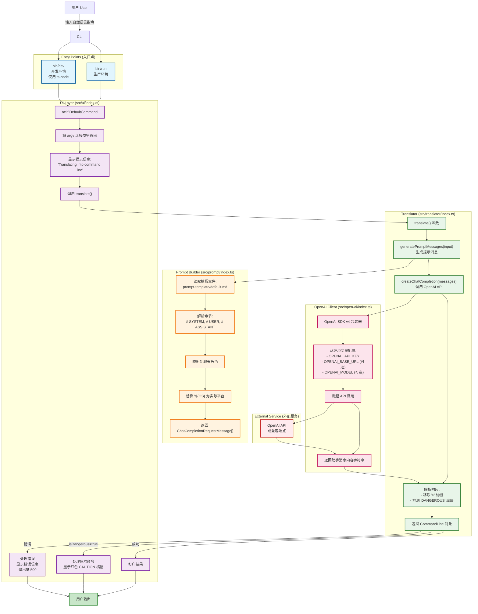

# `ai` CLI Tool - System Architecture

本文档展示了 `ai` CLI 工具的系统架构和数据流程。

## Overview (概述)

`ai` 是一个基于自然语言生成 shell 命令的 CLI 工具,使用 LLM API 将用户的自然语言指令转换为可执行的命令行命令。

## Architecture Diagram (架构图)



## Data Flow (数据流程)

1. **User Input (用户输入)**
   - 用户在命令行输入自然语言指令 (例如: `ai clone react from github`)
   - Shell 通过 `bin/run` (生产) 或 `bin/dev` (开发) 启动 CLI

2. **UI Layer Processing (UI 层处理)**
   - oclif `DefaultCommand` 接收命令参数
   - 将 `argv` 数组连接成单个字符串
   - 显示 "Translating into command line" 提示信息
   - 调用 `translate()` 函数

3. **Translation Process (翻译过程)**
   - **Prompt Generation (提示生成)**:
     - 读取 `prompt-template/default.md` 模板文件
     - 解析 `# SYSTEM`, `# USER`, `# ASSISTANT` 章节
     - 将章节映射到聊天角色
     - 替换模板中的 `${OS}` 占位符为实际操作系统平台
     - 返回格式化的 `ChatCompletionRequestMessage[]` 数组

   - **API Call (API 调用)**:
     - OpenAI Client 使用 SDK v4 发起请求
     - 从环境变量读取配置:
       - `OPENAI_API_KEY` (必需)
       - `OPENAI_BASE_URL` (可选,默认 OpenAI 端点)
       - `OPENAI_MODEL` (可选)
     - 发送请求到 OpenAI API (或兼容端点)
     - 接收助手的响应内容

   - **Response Parsing (响应解析)**:
     - 移除命令前缀的 `>` 字符
     - 检测命令末尾是否有 `DANGEROUS` 标记
     - 构建 `CommandLine` 对象:
       ```typescript
       {
         content: string,        // 生成的命令
         isDangerous?: boolean   // 是否为危险命令
       }
       ```

4. **Output Display (输出显示)**
   - **成功**: 以青色打印生成的命令
   - **危险命令**: 额外显示红色 "CAUTION" 横幅警告用户
   - **错误**: 显示错误信息并以退出码 500 退出

## Module Structure (模块结构)

```
ai-cli/
├── bin/
│   ├── run          # 生产环境入口
│   └── dev          # 开发环境入口 (ts-node)
├── src/
│   ├── ui/
│   │   └── index.ts         # oclif DefaultCommand - UI 层
│   ├── translator/
│   │   └── index.ts         # 翻译器 - 协调提示生成和 API 调用
│   ├── prompt/
│   │   ├── index.ts         # 提示构建器
│   │   └── template.ts      # 模板解析器
│   ├── open-ai/
│   │   └── index.ts         # OpenAI SDK 包装器
│   └── types.ts             # TypeScript 类型定义
├── prompt-template/
│   └── default.md           # 提示模板文件
└── dist/                    # 编译输出 (CommonJS)
```

## Key Types (关键类型)

```typescript
// 命令行输出对象
interface CommandLine {
  content: string;           // 生成的 shell 命令
  isDangerous?: boolean;     // 是否为危险命令 (如 rm, format 等)
}

// OpenAI 聊天消息
interface ChatCompletionRequestMessage {
  role: 'system' | 'user' | 'assistant';
  content: string;
}
```

## Environment Variables (环境变量)

| Variable (变量) | Required (必需) | Description (描述) |
|----------------|----------------|-------------------|
| `OPENAI_API_KEY` | Yes | OpenAI API 密钥 |
| `OPENAI_BASE_URL` | No | 自定义 API 端点 (默认: OpenAI 官方端点) |
| `OPENAI_MODEL` | No | 使用的模型名称 (默认: gpt-3.5-turbo) |

## Technology Stack (技术栈)

- **Framework**: [oclif](https://oclif.io/) - Open CLI Framework
- **Language**: TypeScript (strict mode)
- **Target**: ES2019, CommonJS
- **AI SDK**: OpenAI SDK v4
- **Template Engine**: 自定义 Markdown 解析器
- **Build Tool**: TypeScript Compiler (tsc)
